# Component Architecture Diagram

## System Overview

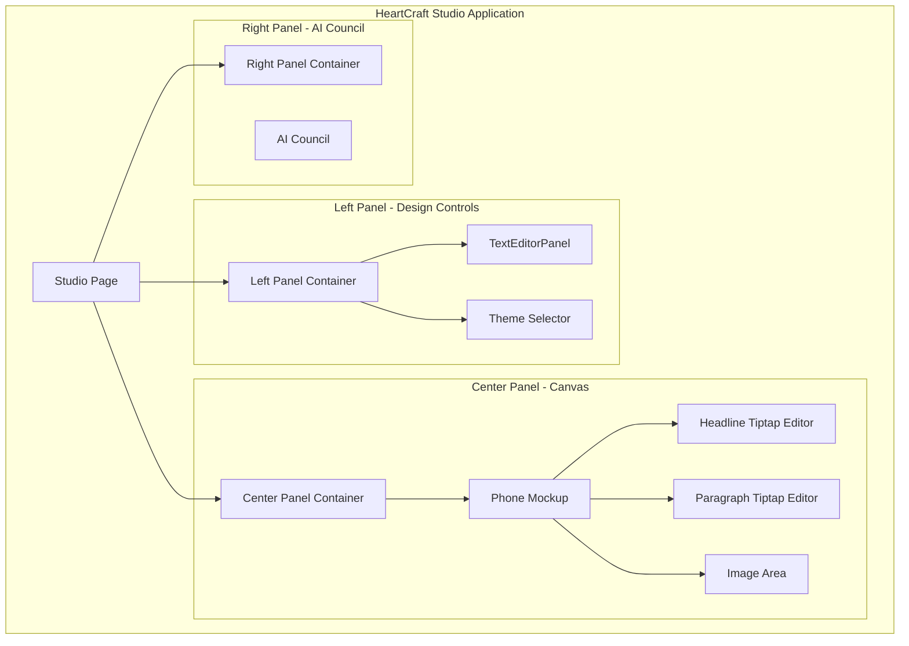

---

## TextEditorPanel Component Tree

```mermaid
graph TB
    TEP[TextEditorPanel]
    
    subgraph "Font Controls"
        FFS[FontFamilySelector]
        FSC[FontSizeControl]
    end
    
    subgraph "Text Styling"
        TST[TextStyleToolbar]
        Bold[Bold Button]
        Italic[Italic Button]
        Underline[Underline Button]
        Strike[Strikethrough Button]
    end
    
    subgraph "Alignment"
        AT[AlignmentToolbar]
        AlignLeft[Left Button]
        AlignCenter[Center Button]
        AlignRight[Right Button]
        Justify[Justify Button]
    end
    
    subgraph "Colors"
        CP[ColorPalette]
        CS1[ColorSwatch Row 1]
        CS2[ColorSwatch Row 2]
        CS3[ColorSwatch Row 3]
        CS4[ColorSwatch Row 4]
        CustomColors[Custom Color Slots]
        CPM[ColorPickerModal]
    end
    
    subgraph "Background"
        BCP[BackgroundColorPicker]
        BGPalette[Background Palette]
    end
    
    subgraph "Lists"
        LC[ListControls]
        TaskList[Task List Button]
        BulletList[Bullet List Button]
        OrderedList[Ordered List Button]
    end
    
    TEP --> FFS
    TEP --> FSC
    TEP --> TST
    TEP --> AT
    TEP --> CP
    TEP --> BCP
    TEP --> LC
    
    TST --> Bold
    TST --> Italic
    TST --> Underline
    TST --> Strike
    
    AT --> AlignLeft
    AT --> AlignCenter
    AT --> AlignRight
    AT --> Justify
    
    CP --> CS1
    CP --> CS2
    CP --> CS3
    CP --> CS4
    CP --> CustomColors
    CP --> CPM
    
    BCP --> BGPalette
    
    LC --> TaskList
    LC --> BulletList
    LC --> OrderedList
```

---

## State Flow Diagram

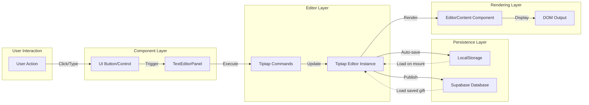

---

## Data Flow: Text Formatting

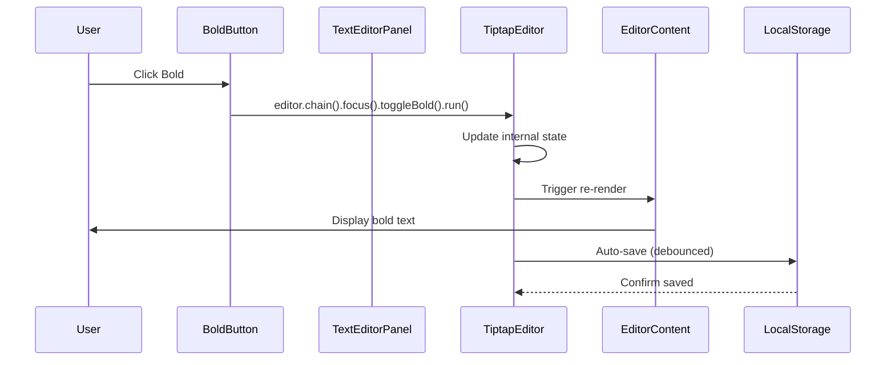

---

## Data Flow: Color Selection

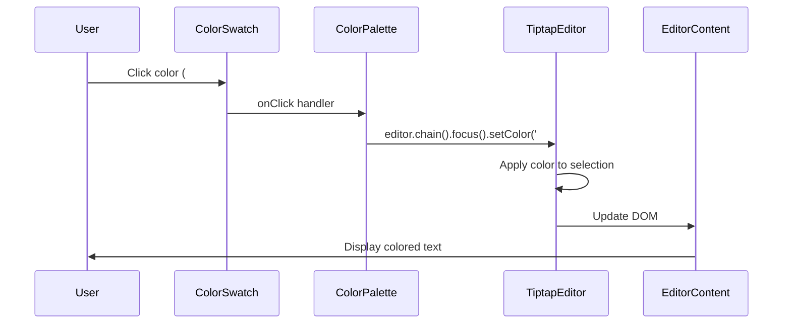

---

## Component File Structure

```
app/
├── studio/
│   └── page.tsx                          # Main studio page (enhanced)
├── gift/
│   └── [id]/
│       └── page.tsx                      # Gift display page (enhanced)
└── globals.css                           # Global styles + Tiptap styles

components/
└── text-editor/
    ├── TextEditorPanel.tsx               # Main panel orchestrator
    ├── FontFamilySelector.tsx            # Font dropdown
    ├── FontSizeControl.tsx               # Size control with +/-
    ├── TextStyleToolbar.tsx              # B, I, U, S buttons
    ├── AlignmentToolbar.tsx              # Alignment buttons
    ├── ColorPalette.tsx                  # Color grid
    ├── ColorSwatch.tsx                   # Individual color button
    ├── BackgroundColorPicker.tsx         # Highlight color picker
    ├── ListControls.tsx                  # List formatting buttons
    ├── ColorPickerModal.tsx              # Advanced color picker
    ├── types.ts                          # TypeScript interfaces
    ├── constants.ts                      # Colors, fonts, sizes
    ├── extensions/
    │   └── FontSize.ts                   # Custom Tiptap extension
    ├── hooks/
    │   ├── useTextEditor.ts              # Editor initialization hook
    │   └── useColorPicker.ts             # Color picker logic
    └── styles.css                        # Component-specific styles

lib/
└── supabase.ts                           # Supabase client (existing)
```

---

## Tiptap Extension Architecture

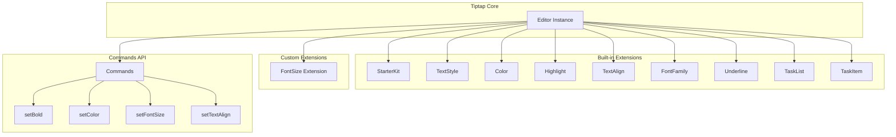

---

## State Management Pattern

```mermaid
graph TB
    subgraph "React State"
        SelectedItem[selectedItem: 'headline' | 'paragraph' | 'image' | 'none']
        HeadlineEditor[headlineEditor: Editor | null]
        ParagraphEditor[paragraphEditor: Editor | null]
        Theme[theme: string]
    end
    
    subgraph "Tiptap Internal State"
        EditorState[Editor State]
        Selection[Text Selection]
        Marks[Active Marks]
        Attributes[Node Attributes]
    end
    
    subgraph "Derived State"
        IsBold[isBold: boolean]
        CurrentColor[currentColor: string]
        CurrentFont[currentFont: string]
        CurrentSize[currentSize: number]
    end
    
    SelectedItem -->|Determines active editor| HeadlineEditor
    SelectedItem -->|Determines active editor| ParagraphEditor
    
    HeadlineEditor --> EditorState
    ParagraphEditor --> EditorState
    
    EditorState --> Selection
    EditorState --> Marks
    EditorState --> Attributes
    
    Marks --> IsBold
    Attributes --> CurrentColor
    Attributes --> CurrentFont
    Attributes --> CurrentSize
```

---

## Integration Points with Existing HeartCraft

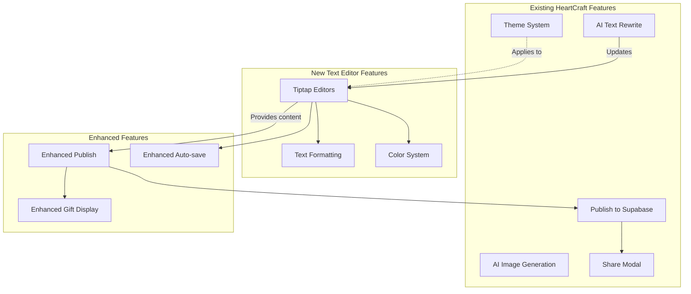

---

## Rendering Pipeline

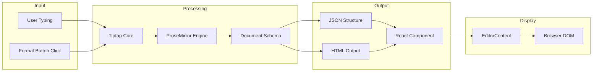

---

## Persistence Strategy

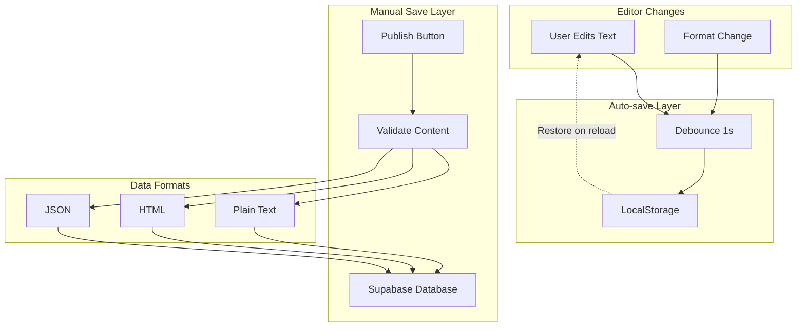

---

## Event Flow: Complete Formatting Action

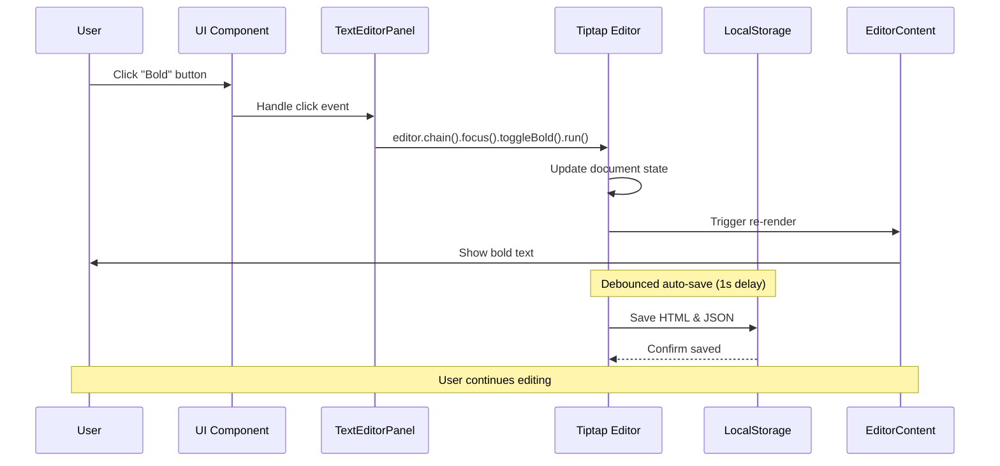

---

## Responsive Layout Strategy

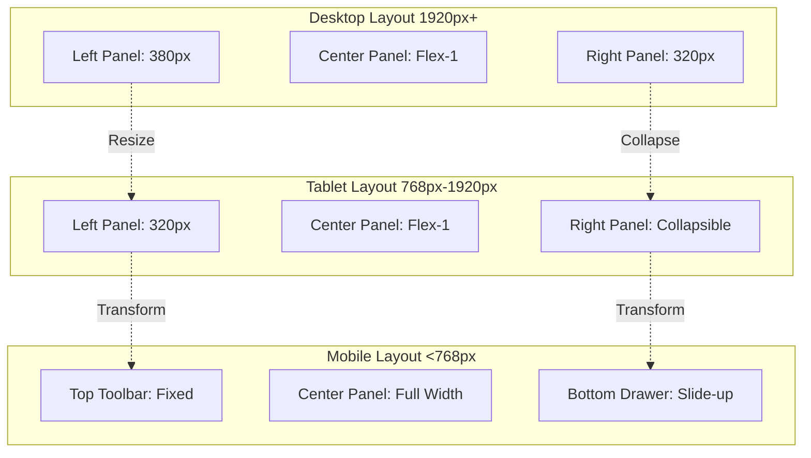

---

## Error Handling Flow

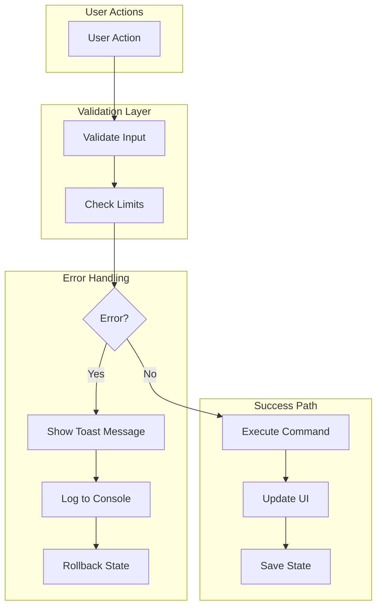

---

## Performance Optimization Strategy

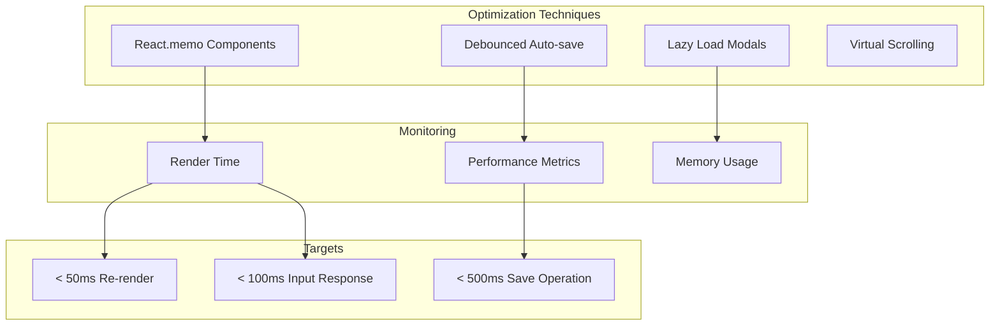

---

## Testing Architecture

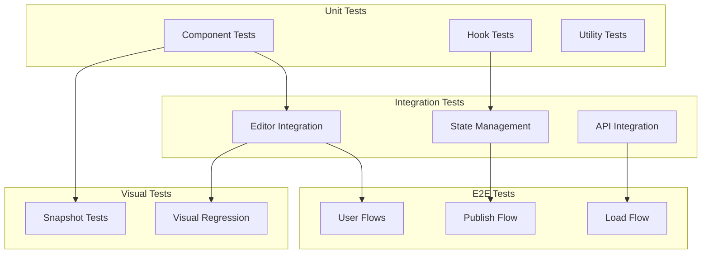

---

## Deployment Pipeline

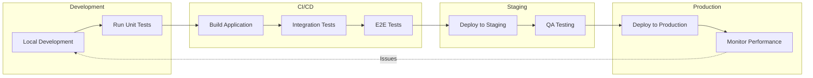

---

## Summary

This architecture provides:

1. **Clear Separation of Concerns**: UI components, business logic, and data persistence are separated
2. **Scalability**: Easy to add new formatting features or tools
3. **Maintainability**: Well-organized component structure with clear responsibilities
4. **Performance**: Optimized with memoization, debouncing, and lazy loading
5. **Testability**: Each layer can be tested independently
6. **Integration**: Seamlessly integrates with existing HeartCraft features

The architecture follows React and Tiptap best practices while maintaining the Samsung Notes UI/UX standards.
